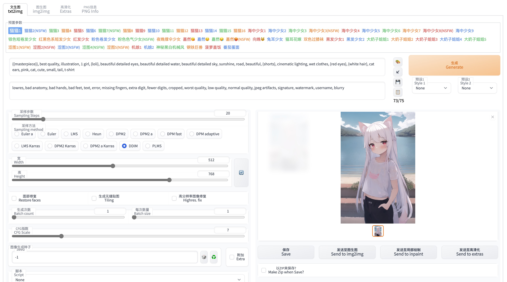

# sd-webui-custom
给[Stable Diffusion web UI](https://github.com/AUTOMATIC1111/stable-diffusion-webui)加点料

## 功能
- 隐藏了一些功能和设置入口
- 预置了一些参数合集，方便快速起步
- 添加中文翻译(感谢VinsonLaro发布的中文翻译文本)

## 安装
需要使用最新版本的webui

把`ui_custom`目录放到webui根目录   
`user.css`丢到根目录   
`custom_ui.js`丢到`javascript`目录   
重启程序，webui会自动加载

## Credits
[StableDiffusion Show](https://t.me/StableDiffusion_Show)   
[VinsonLaro](https://www.bilibili.com/video/BV1VG41177ha)
